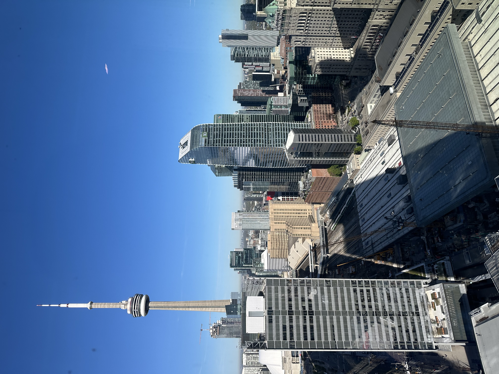

# The Markdown Tutorials
- [The Markdown Tutorials](#the-markdown-tutorials)
  - [Tables](#tables)
- [OSI Model](#osi-model)
  - [Images](#images)
## Tables
| First Name | Last name | Initials |
| :--------- | :-------: | -------: |
| Karshi     |  Hasanov  |      KFH |

# OSI Model
|  OSI Layers  |
| :----------: |
| Application  |
| Presentation |
|   Session    |
|  Transport   |
|   Network    |
|  Data Link   |
|   Physical   |


## Images
```

```

## Links
This is how you link you document:
For a search, please visit [Google](https://www.google.ca)


